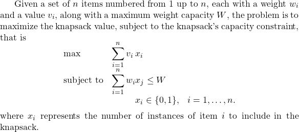
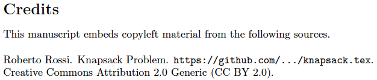

# copyleft
A LaTeX package for embedding copyleft material in a LaTeX document.

## Usage
The `copyleft` LaTeX package can be used in a latex manuscript by leveraging command
```
\usepackage{copyleft}
```

### The `copyleft` environment

The `copyleft` environment can be used to enclose and annotate blocks of copyleft material in a LaTeX document

#### Example
The following LaTeX code can be stored into a file `knapsack.tex`, which can be then embedded into a LaTeX document via command `\input{knapsack.tex}`.
```
\begin{copyleft}
{Roberto Rossi}                                        % Author
{Knapsack Problem}                                     % Title
{\url{https://github.com/gwr3n/tex/knapsack.tex}}      % Source
{Creative Commons Attribution 2.0 Generic (CC BY 2.0)} % License

Given a set of $n$ items numbered from 1 up to $n$, 
each with a weight $w_i$ and a value $v_i$, 
along with a maximum weight capacity $W$, the problem 
is to maximize the knapsack value, subject to the 
knapsack's capacity constraint, that is 
\[
\begin{array}{ll@{}ll}
\mathrm{max}        & \displaystyle\sum\limits_{i=1}^{n} v_{i}&x_{i} &\\
\mathrm{subject~to} & \displaystyle\sum\limits_{i=1}^{n} w_{i}&x_{j} \leq W\\
                    &                                        
                    &x_{i} \in \{0,1\}, &i=1 ,\dots, n.
\end{array}
\]
where $x_{i}$ represents the number of instances of item $i$ 
to include in the knapsack.

\end{copyleft}
```

[comment]: # (https://quicklatex.com/)


### The `\printcopyleft` command
The `\printcopyleft` command can be used at the end of a document to print a list of copyleft credits compiled from the annotations in the blocks of copyleft material in a LaTeX document.

#### Example
The result of the `\printcopyleft` command for the above example is the following.


